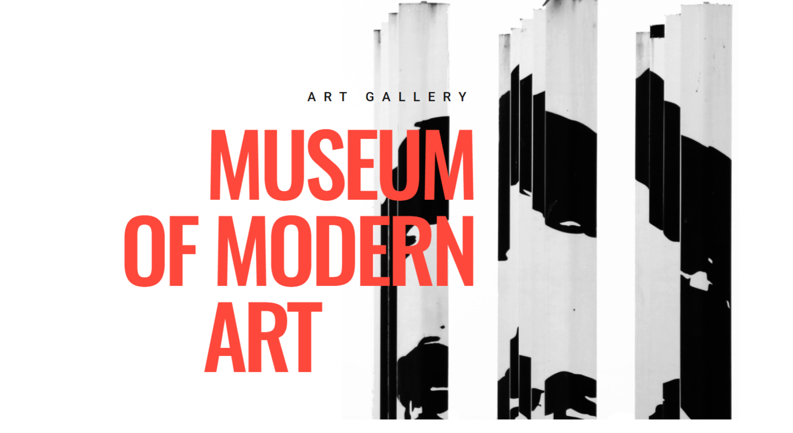
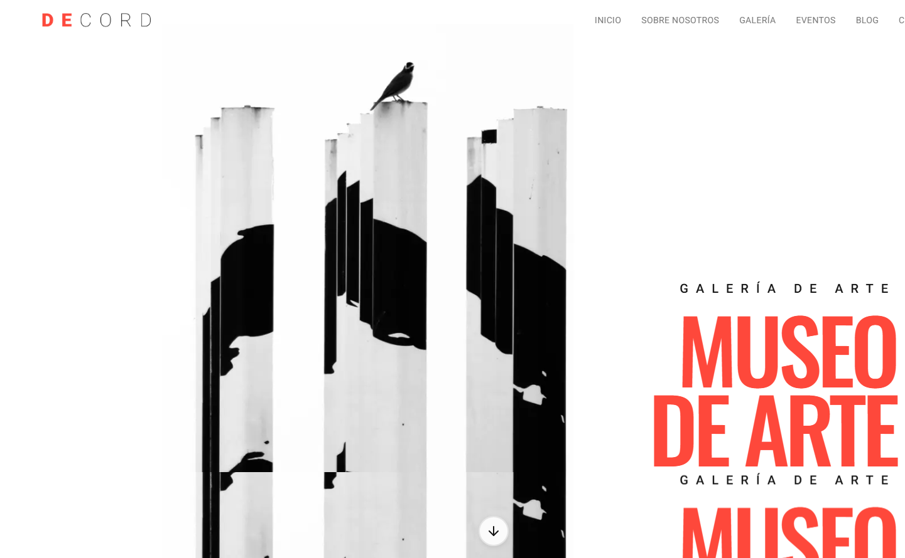
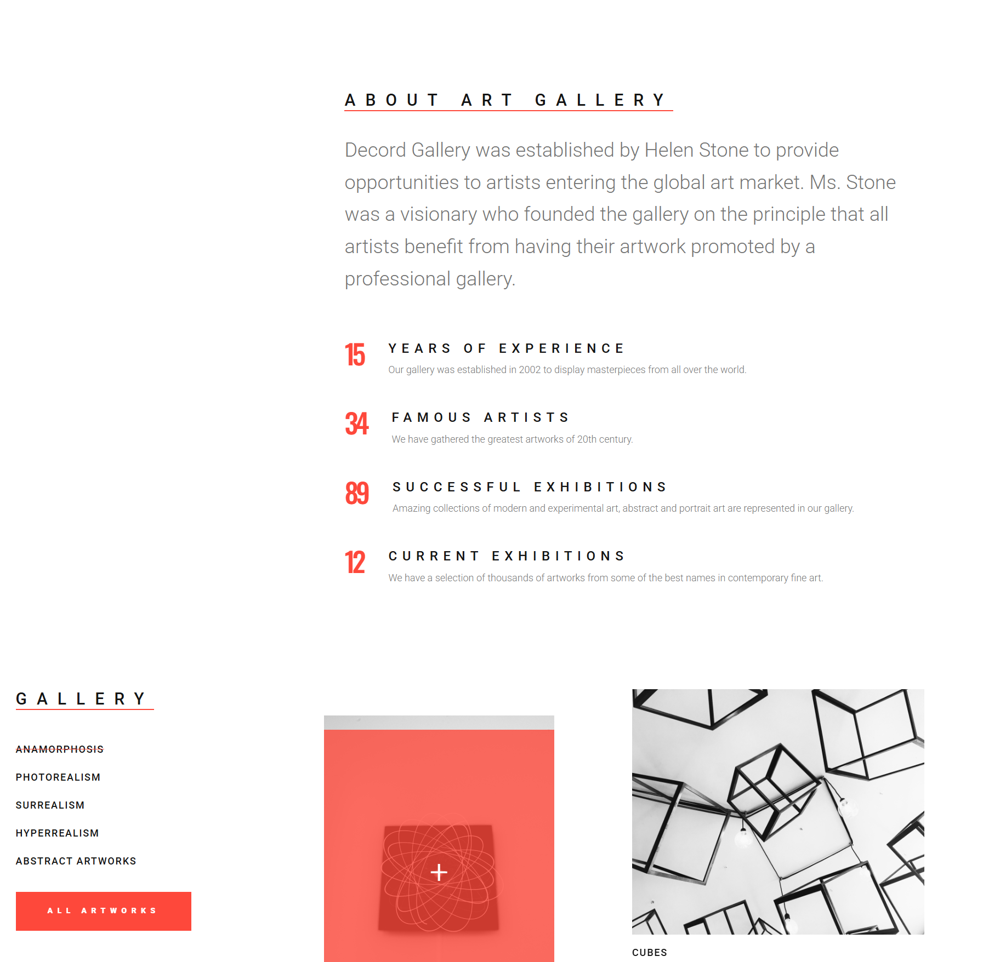

# Notas preliminares
Para más detalles sobre inspección de elementos y pruebas visuales en layouts, consulta la documentación de `devtools.prompt.md` o explora sus opciones desde las herramientas de desarrollo del navegador para obtener recomendaciones e instrucciones interactivas.
Si el servidor de desarrollo ya está corriendo no lo incicies si no lo ves necesario.

## Referencias de imágenes (sección inicial)

Original:

Clon:

**URL de la web a clonar:**
https://ld-wt73.template-help.com/tf/decord_v1/

# INSTRUCCIONES GENERALES PARA CLONAR LAYOUTS

- Modifica este mismo prompt para que en la próxima interación al analizar las imágenes del original y el resultado final. Haz un análisis de las imágenes en terminos de ux/ui. Según ese análisis modifica el prompt layout. Comprueba resultados tanto con capturas de pantalla como mirando el código del original (devtools de chrome) y el clone.

- Asegúrate que las fuentes tipográficas coinciden con las originales, asegúrate de los tamaños de las letras sea como en el original.
---
- Si haces capturas de imagen para comparar el original con el clone reduce el tamaño de la imagen: Asegúrate de que ni el ancho ni el alto superen los 4000 píxeles. Comprueba el formato: Si estás usando base64, verifica que la codificación sea correcta y que no haya errores en el string. Evita imágenes extremadamente grandes: Aunque se vean bien en tu editor, pueden causar problemas al procesarlas en servidores con límites.
- Hazlo todo responsive.
- Corrige posibles errores con next-devtools mcp
- Acuérdate de hacer la WEB SEMÁNTICA y accesible.
- Copia exactamente  las interaciones, las  micronanimaciones y animaciones de cada página. El scroll debe ser el mismo que el scroll original. Itera hasta que se parezca.
- Completa todo el recorrido de esta lista de tareas. Vuelve a revisarlas.
- Corrige errores de typescript y warnings de eslint.
- Corrige errores con next-devtools mcp.
- Haz el build para capturar errores o utiliza next-devtools mcp para capturar errores de producción.

# TAREAS Y CORRECCIONES

# INICIO - PRIMERA SECCIÓN: 
## Instrucciones para colocar imagen de fondo y textos en HTML/CSS

## 1. Contenedor principal
- Crear un bloque que ocupe toda la pantalla (alto y ancho completos).
- Usar este bloque como área donde se coloca la imagen de fondo y el texto.

## 2. Imagen de fondo
- Definir la imagen como fondo del contenedor.
- Ajustar la imagen para que siempre cubra todo el espacio visible (cover).
- Centrar la imagen para evitar cortes extraños.
- Aplicar un overlay semitransparente si es necesario para mejorar contraste.

## 3. Bloque de texto
- Añadir un contenedor interno para los textos.
- Centrar este bloque tanto vertical como horizontalmente dentro del contenedor principal.
- Limitar el ancho máximo del bloque para que el texto no se extienda demasiado.

## 4. Jerarquía tipográfica
- Colocar primero el texto secundario (“ART GALLERY”) en la parte superior del bloque.
- Debajo, colocar el texto principal (“MUSEUM OF MODERN ART”) con mayor tamaño y peso.
- Mantener un espacio vertical entre ambos textos para diferenciarlos.

## 5. Alineación y estilo
- Alinear todo el texto al centro.
- Usar mayúsculas en ambos textos para reforzar impacto visual.
- Ajustar el espaciado entre letras del texto secundario para darle un estilo más refinado.

## 6. Accesibilidad
- Asegurar que el contraste entre texto y fondo sea suficiente.
- Usar etiquetas semánticas adecuadas (ejemplo: encabezado principal como `<h1>`).
- Añadir descripción alternativa de la imagen para lectores de pantalla.

## 7. Responsive
- Escalar el tamaño de las fuentes según el ancho de pantalla (más pequeño en móviles, más grande en desktop).
- Mantener siempre el bloque de texto centrado.
- Evitar que el título ocupe más de 2–3 líneas en pantallas pequeñas.

# SUBSECCIÓN: About gallery

Original:

## Descripción UI/UX para implementación de la sección "About gallery"

### Estructura general del layout

La sección completa está organizada en dos áreas principales que se apilan verticalmente:

**Área superior (aproximadamente 60-65% del espacio vertical):**
- Contiene el título principal, un párrafo descriptivo y un grid de estadísticas
- Todo el contenido está centrado horizontalmente con márgenes laterales generosos

**Área inferior (aproximadamente 35-40% del espacio vertical):**
- Dividida en dos columnas de ancho similar (la columna derecha puede ser ligeramente más ancha)
- Columna izquierda: navegación de categorías de galería
- Columna derecha: galería de imágenes de arte

### Contenedor principal

- Fondo completamente blanco, sin degradados ni texturas
- Padding vertical generoso (equivalente a aproximadamente 80-100px en desktop)
- Padding horizontal amplio (equivalente a aproximadamente 120-140px en desktop)
- Ancho máximo del contenido centrado (aproximadamente 1400px)
- El contenido debe estar centrado horizontalmente en la pantalla

### Título "ABOUT ART GALLERY"

**CRÍTICO - Posicionamiento y estructura:**
- Centrado horizontalmente en la sección superior
- ⚠️ **IMPORTANTE**: El título debe renderizarse como UNA SOLA LÍNEA CONTINUA: "ABOUT ART GALLERY"
- ⚠️ **NO dividir en palabras separadas** - debe ser un texto corrido
- El subrayado decorativo es CONTINUO bajo TODO el título (de principio a fin)
- NO usar flex con wrap ni dividir en spans individuales

**Tipografía:**
- Fuente sans-serif moderna y limpia (Roboto o similar)
- Tamaño grande (equivalente a aproximadamente 40-48px en desktop)
- Peso de fuente regular a medium (400-500, NO bold 700)
- Todo el texto en mayúsculas
- ⚠️ **CRÍTICO**: Espaciado entre letras muy amplio (letter-spacing de aproximadamente 10-15px)
- Interlineado ajustado (line-height de aproximadamente 1.2)
- Color de texto negro sólido (#000000)

**Subrayado decorativo:**
- Color rojo vibrante (similar to #fe483b - color exacto del original)
- Grosor del subrayado de aproximadamente 2-3px
- Separación del texto de aproximadamente 6-8px (text-underline-offset)
- ⚠️ **CRÍTICO**: El subrayado es CONTINUO bajo TODO el texto, no selectivo por palabras
- Usar text-decoration: underline con text-underline-offset

**Espaciado:**
- Margen inferior generoso (aproximadamente 40-50px) para separar del párrafo

### Párrafo descriptivo

**Posicionamiento:**
- Centrado horizontalmente en la página
- ⚠️ **Ancho máximo más estrecho**: aproximadamente 700-750px (NO 900px)
- Espaciado inferior generoso (aproximadamente 60-70px) antes de las estadísticas

**Tipografía:**
- Fuente sans-serif, misma familia que el título (Roboto)
- Tamaño de lectura cómodo (aproximadamente 16px)
- Peso regular (400)
- Interlineado amplio (line-height de aproximadamente 1.7-1.8) para facilitar la lectura
- ⚠️ **Color gris medio/claro** (similar a #999999 o #9a9a9a, NO #333333)
- Texto centrado o justificado, no alineado a la izquierda

**Contenido:**
- El párrafo describe la historia y misión de la galería
- Texto fluido y legible, sin saltos de línea forzados

### Grid de estadísticas (4 elementos)

**Estructura del grid:**
- Grid de 4 columnas en desktop (una estadística por columna)
- Espaciado horizontal uniforme entre columnas (gap de aproximadamente 40px)
- Cada elemento del grid contiene: número grande, etiqueta en mayúsculas, y descripción

**Número de la estadística:**
- ⚠️ **Tamaño mediano-grande**: aproximadamente 50-60px (NO 64-72px)
- Color rojo vibrante (#fe483b - color exacto del sitio original)
- Peso bold (700)
- Interlineado ajustado (line-height de 1)
- Alineado a la izquierda dentro de su columna
- Espaciado inferior pequeño (aproximadamente 8-12px) antes de la etiqueta

**Etiqueta de la estadística:**
- Texto en mayúsculas
- Tamaño pequeño (aproximadamente 14px)
- Peso semi-bold (600)
- Color negro sólido
- Espaciado entre letras ligeramente aumentado (letter-spacing de aproximadamente 1px)
- Espaciado inferior pequeño (aproximadamente 12px) antes de la descripción

**Descripción de la estadística:**
- Tamaño pequeño (aproximadamente 14px)
- Peso regular (400)
- Color gris medio (similar a #666666)
- Interlineado cómodo (line-height de aproximadamente 1.6)
- Texto alineado a la izquierda

**Espaciado general:**
- Margen inferior generoso (aproximadamente 80px) antes de la sección inferior

### Sección inferior: Layout de dos columnas

**Estructura:**
- Grid de 2 columnas
- La columna derecha puede ser ligeramente más ancha que la izquierda (proporción aproximada 1:1.2)
- Espaciado horizontal entre columnas (gap de aproximadamente 60px)
- Alineación superior de ambas columnas

### Columna izquierda: Sección "GALLERY"

**Título "GALLERY":**
- Tamaño grande (aproximadamente 42-48px)
- Peso bold (700)
- Texto en mayúsculas
- Subrayado decorativo en rojo (mismo estilo que el título principal)
- Color negro
- Alineado a la izquierda
- Espaciado inferior generoso (aproximadamente 40px) antes de la lista

**Lista de categorías:**
- Lista vertical sin viñetas ni números
- Cada categoría en su propia línea
- Espaciado vertical uniforme entre elementos (aproximadamente 12px de padding vertical)
- Separador visual sutil entre elementos (borde inferior de 1px en gris muy claro, similar a #e5e5e5)
- El último elemento no tiene separador

**Tipografía de categorías:**
- Fuente sans-serif
- Tamaño estándar (aproximadamente 16px)
- Peso regular (400)
- Color negro
- Texto en mayúsculas
- Espaciado entre letras ligeramente aumentado (letter-spacing de aproximadamente 1px)
- Alineado a la izquierda

**Botón "ALL ARTWORKS":**
- Posicionado al final de la columna, después de la lista
- Fondo sólido rojo (mismo rojo que los acentos)
- Texto en color blanco
- Tamaño de fuente pequeño (aproximadamente 14px)
- Peso semi-bold (600)
- Texto en mayúsculas
- Espaciado entre letras aumentado (letter-spacing de aproximadamente 1px)
- Padding generoso (aproximadamente 16px vertical y 32px horizontal)
- Sin borde visible
- Alineado a la izquierda (no centrado)
- Debe tener un efecto hover que oscurezca ligeramente el rojo

### Columna derecha: Galería de imágenes

**Estructura:**
- Grid de 2 columnas para las imágenes
- Espaciado horizontal pequeño entre imágenes (gap de aproximadamente 20px)
- Las imágenes deben mantener proporción cuadrada (aspect-ratio 1:1)

**Imágenes:**
- Cada imagen debe cubrir completamente su contenedor manteniendo su proporción
- Las imágenes deben recortarse de manera centrada si es necesario
- Calidad de imagen nítida y clara

**Etiqueta de imagen (si aplica):**
- Algunas imágenes pueden tener una etiqueta de texto debajo
- Tamaño pequeño (aproximadamente 14px)
- Peso regular (400)
- Color negro
- Texto en mayúsculas
- Alineado a la izquierda
- Espaciado superior pequeño (aproximadamente 12px) desde la imagen

### Paleta de colores

- **Rojo principal:** Color vibrante para acentos, subrayados, números y botón (similar a #dc2626 o #e63946)
- **Negro:** Para títulos principales, etiquetas y texto destacado (#000000)
- **Gris oscuro:** Para párrafos descriptivos (#333333)
- **Gris medio:** Para descripciones secundarias (#666666)
- **Gris claro:** Para separadores y bordes sutiles (#e5e5e5)
- **Blanco:** Fondo principal de la sección (#ffffff)
- **Blanco:** Texto del botón sobre fondo rojo (#ffffff)

### Espaciado y proporciones

- Los espaciados deben ser generosos y respirables
- Mantener consistencia en los espaciados verticales entre secciones
- El padding horizontal debe ser proporcional al ancho de la pantalla
- En desktop, los márgenes laterales deben ser amplios para crear un diseño centrado y elegante

### Responsive design

**Tablet (768px - 1024px):**
- Reducir padding horizontal y vertical proporcionalmente
- Grid de estadísticas debe cambiar a 2 columnas (2x2)
- Sección inferior debe apilarse verticalmente (una columna)
- Tamaños de fuente deben reducirse ligeramente
- Mantener proporciones y espaciados relativos

**Mobile (menos de 768px):**
- Padding horizontal y vertical más reducido
- Grid de estadísticas debe cambiar a 1 columna (apilado vertical)
- Título principal debe reducirse significativamente
- Números de estadísticas deben reducirse pero mantener prominencia
- Sección inferior debe apilarse verticalmente
- Galería de imágenes debe cambiar a 1 columna (imágenes apiladas)
- Todos los elementos deben mantener legibilidad y jerarquía visual

### Accesibilidad

- Usar etiquetas semánticas HTML apropiadas (section, h2, h3, ul, button)
- Asegurar contraste mínimo de 4.5:1 para texto normal sobre fondo blanco
- Asegurar contraste mínimo de 3:1 para texto grande (títulos) sobre fondo blanco
- Añadir texto alternativo descriptivo a todas las imágenes
- El botón debe ser accesible por teclado y tener estados de focus visibles
- Las categorías de la lista deben ser navegables por teclado si son interactivas
- Mantener orden lógico de lectura para lectores de pantalla

### Consideraciones de diseño

- El diseño debe transmitir elegancia y modernidad
- La tipografía debe ser limpia y legible en todos los tamaños
- Los espacios en blanco son importantes para la respirabilidad del diseño
- El rojo debe usarse estratégicamente como acento, no como color dominante
- La jerarquía visual debe ser clara: título > estadísticas > contenido secundario
- Las imágenes deben integrarse armoniosamente sin competir con el contenido textual