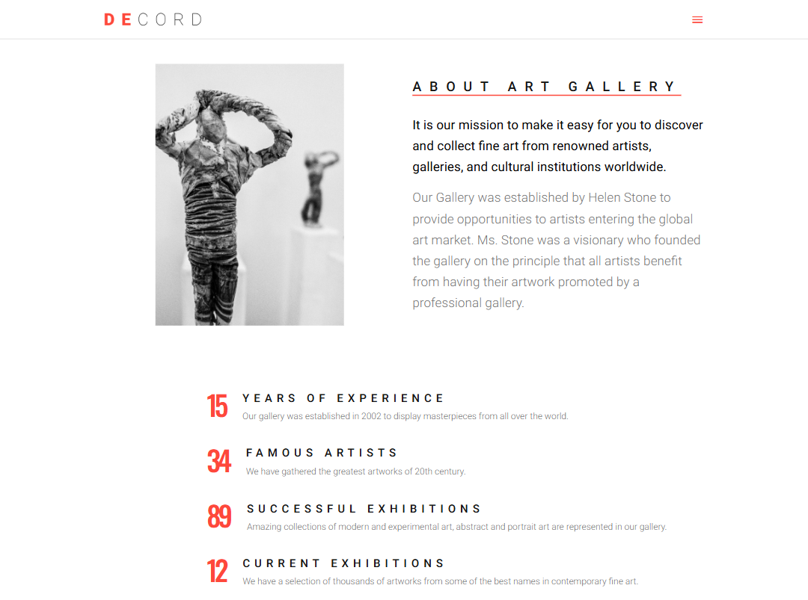
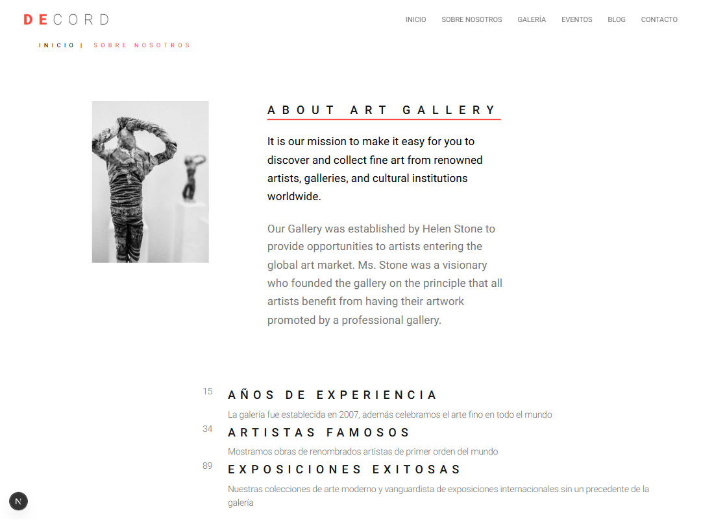

# Notas preliminares
Para más detalles sobre inspección de elementos y pruebas visuales en layouts, consulta la documentación de `devtools.prompt.md` o explora sus opciones desde las herramientas de desarrollo del navegador para obtener recomendaciones e instrucciones interactivas.
Si el servidor de desarrollo ya está corriendo no lo incicies si no lo ves necesario, a no ser que hagas una build, entonces te toca pararlo y volver a iniciarlo después de la build.

**URL de la web ORGINAL para clonar:**
https://ld-wt73.template-help.com/tf/decord_v1/

# INSTRUCCIONES GENERALES PARA CLONAR LAYOUTS

- Lleva un registro de lo hecho en esta carpeta para que en la próxima interación al analizar las imágenes del original y el resultado final en la carpeta `track`. Haz un análisis de las imágenes en terminos de ux/ui. Según ese análisis modifica el prompt layout. Comprueba resultados tanto con capturas de pantalla como mirando el código del original (devtools de chrome) y el clone.

- Asegúrate que las fuentes tipográficas coinciden con las originales, asegúrate de los tamaños de las letras sea como en el original.
---
- Si haces capturas de imagen para comparar el original con el clone reduce el tamaño de la imagen: Asegúrate de que ni el ancho ni el alto superen los 4000 píxeles. Comprueba el formato: Si estás usando base64, verifica que la codificación sea correcta y que no haya errores en el string. Evita imágenes extremadamente grandes: Aunque se vean bien en tu editor, pueden causar problemas al procesarlas en servidores con límites.
- Hazlo todo responsive.
- Corrige posibles errores con next-devtools mcp
- Acuérdate de hacer la WEB SEMÁNTICA y accesible.
- Copia exactamente  las interaciones, las  micronanimaciones y animaciones de cada página. El scroll debe ser el mismo que el scroll original. Itera hasta que se parezca.
- Completa todo el recorrido de esta lista de tareas. Vuelve a revisarlas.
- Corrige errores de typescript y warnings de eslint.
- Corrige errores con next-devtools mcp.
- Haz el build para capturar errores o utiliza next-devtools mcp para capturar errores de producción.

# Metodo de trabajo para corregir layouts
**IMPORTANTE:** Sigue este método de trabajo para cada corrección que realices en los layouts:
**Metodo de trabajo:**
- Inspecciona el original con devtools.
- Inspecciona el clone con devtools.
- Compara ambos códigos y estilos.
- Anota las diferencias y errores.
- Modifica el prompt layout para corregir los errores.
- Repite el proceso hasta que el clone sea idéntico al original.
- Documenta los cambios realizados en la sección de reportes.
- Asegúrate de que todas las correcciones estén reflejadas en el código y estilos.
- Verifica que el clone funcione correctamente en diferentes navegadores y dispositivos.
- Toma capturas de pantalla del original y del clone para documentar las diferencias y mejoras.
---

# **TAREAS Y CORRECCIONES**

# GALLERY PAGE y HOME PAGE GALLERY SECTION 
**Problemas:**
- Se renderizan dos gallerías que son la misma. Esto está bien  porque usan el mismo componente, pero la galería de la página "Inicio" no se ve correctamente en términos de diseño. El problema es que los filtros aparecen en la izquierda y las imágenes a mostrar por los filtros se acomodan abajo, en lugar de a la derecha como en la página "Galería".
**Solución propuesta:**
- Hacer que en la página "Inicio" utilice la misma galería que en la página "Galería" INCLUYENDO LOS FILTROS, evitando la duplicación innecesaria del componente.

# ABOUT PAGE - PÁGINA ABOUT
**Problemas:**

- No se parecen. CÉNTRATE EN El tamaño de la imagen original dado que no corresponde con la original. 
- La enumeración de experiencia: los tamaños los números, su grosor y color, el de las letras, interlineado, etc no se parece. Ajústalo para que se parezca más al original.